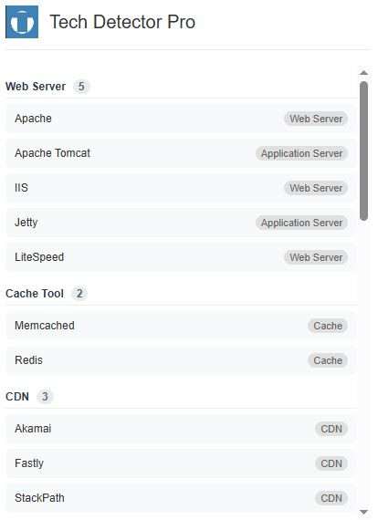

# Tech Detector Pro


<p align="center">
  
</p>

Tech Detector Pro è un'estensione per Google Chrome che analizza e identifica in tempo reale le tecnologie utilizzate dai siti web che stai visitando. Ottieni informazioni dettagliate su web server, framework, librerie, database e molto altro con un solo clic!

## 📸 Screenshot

<p align="center">
  
</p>

## ✨ Caratteristiche

Tech Detector Pro rileva un'ampia gamma di tecnologie, suddivise per categorie:

### 🔧 Infrastruttura
- **Web Server**: Apache, Nginx, IIS, LiteSpeed, Tomcat, Jetty
- **Cache Tool**: Varnish, Redis, Memcached, Cloudflare Cache
- **CDN**: Cloudflare, Akamai, Fastly, Amazon CloudFront, jsDelivr, CDNJS, StackPath
- **PaaS**: GitHub Pages, AWS, Netlify, Vercel, Heroku, Firebase Hosting

### 💻 Frontend
- **JavaScript Framework**: React, Angular, Vue.js, Svelte, Next.js, Gatsby, Nuxt.js, Ember.js, Alpine.js
- **JavaScript Library**: jQuery, Lodash, Underscore.js, Moment.js, D3.js, Three.js, Chart.js, Socket.io, Axios, Redux
- **CSS Framework**: Bootstrap, Tailwind CSS, Bulma, Foundation, Material Design, Semantic UI

### 🗄️ Backend
- **CMS**: WordPress, Drupal, Joomla, Magento, Shopify, Ghost, Contentful, Strapi
- **Linguaggi di programmazione**: PHP, Ruby, Python, Node.js
- **Framework Backend**: Laravel, Symfony, CodeIgniter, Ruby on Rails, Django, Flask, Express.js
- **Database**: MySQL, PostgreSQL, MongoDB, SQLite, Oracle, Microsoft SQL Server, Redis, Firebase

### 📊 Analytics e Marketing
- **Analytics**: Google Analytics (Universal e GA4), Adobe Analytics
- **Marketing**: Facebook Pixel, HubSpot, Optimizely
- **Tag Manager**: Google Tag Manager
- **Network Pubblicitari**: Google AdSense, Google Publisher Tag, DoubleClick, Amazon Advertising, Prebid

### 🔐 Sicurezza e Prestazioni
- **Security**: HSTS, CSP, CORS
- **PWA**: Progressive Web App
- **Static Site Generators**: Jekyll, Hugo, Gatsby, Next.js

### 🧩 Altri
- **Font**: Font Awesome, Google Fonts
- **Bundler e Build Tools**: Webpack
- **Utilità**: Open Graph, ServiceNow

## 🚀 Installazione

### Da Chrome Web Store
1. Visita la [pagina dell'estensione su Chrome Web Store](#)
2. Clicca su "Aggiungi a Chrome"

### Manualmente (per sviluppatori)
1. Clona questo repository:
   ```bash
   git clone https://github.com/tuoUsername/tech-detector-pro.git
   ```
2. Apri Chrome e vai alla pagina delle estensioni: `chrome://extensions/`
3. Abilita la "Modalità sviluppatore" (interruttore nell'angolo in alto a destra)
4. Clicca su "Carica estensione non pacchettizzata"
5. Seleziona la cartella `tech_detector_pro` dal repository clonato

## 🎮 Utilizzo

1. Naviga su qualsiasi sito web
2. Clicca sull'icona di Tech Detector Pro nella barra degli strumenti di Chrome
3. Visualizza l'elenco completo delle tecnologie rilevate, organizzate per categoria
4. Esplora dettagli aggiuntivi come versioni e tipi di tecnologia

## 🔍 Come funziona

Tech Detector Pro analizza diversi aspetti della pagina web corrente:
- Analizza il DOM alla ricerca di pattern ed elementi caratteristici
- Esamina i meta tag, gli script e i fogli di stile
- Verifica la presenza di variabili globali e oggetti JavaScript specifici
- Controlla commenti HTML, cookie e altri indicatori

Tutto questo avviene localmente nel tuo browser, senza inviare dati a server esterni.

## 🛠️ Sviluppo

### Prerequisiti
- Python 3.6+ con Pillow installato (`pip install Pillow`)

### Generazione dell'estensione
```bash
python build_extension.py
```

### Struttura del progetto
```
tech_detector_pro/
├── icons/              # Icone dell'estensione
├── manifest.json       # Configurazione dell'estensione
├── popup.html          # Interfaccia utente
└── popup.js            # Logica di rilevamento e visualizzazione
```

## 📜 Licenza

Questo progetto è rilasciato sotto licenza MIT. Vedi il file [LICENSE](LICENSE) per i dettagli.

## 🤝 Contribuire

I contributi sono benvenuti! Sentiti libero di aprire issue o inviare pull request.

1. Fai un fork del repository
2. Crea un branch per la tua funzionalità (`git checkout -b feature/AmazingFeature`)
3. Commit delle tue modifiche (`git commit -m 'Add some AmazingFeature'`)
4. Push al branch (`git push origin feature/AmazingFeature`)
5. Apri una Pull Request

## 📚 Wiki

Per informazioni più dettagliate, guide per gli sviluppatori e FAQ, consulta la [Wiki](https://github.com/tuoUsername/tech-detector-pro/wiki).
